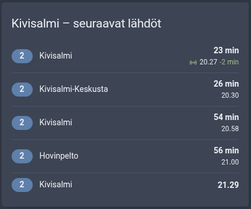

# Digitransit Live for Home Assistant

Home Assistant integration that turns Digitransit's live buses, trams and stop departures into map feeds and sensors.

[![GitHub Release][releases-shield]][releases] [![GitHub Release Date][release-date-shield]][releases]

[![HACS][hacs-shield]][hacs] [![Home Assistant][home-assistant-shield]][home-assistant] [![License][license-shield]](LICENSE)

![Project Maintenance][maintenance-shield] [![GitHub Activity][commits-shield]][commits] [![Open bugs][bugs-shield]][bugs] [![Open enhancements][enhancements-shield]][enhancements]

## Support

Hey dude! Help me out for a couple of :beers: or a :coffee:!

[](https://www.buymeacoffee.com/jesmak)

## What is it?

A custom component that turns live public transport vehicles from [Digitransit](https://digitransit.fi/)'s MQTT
broker into **map feeds**: one sensor per feed, holding every bus, tram or train in it as GeoJSON.

Show the feeds on a map with [ha-map-card](https://github.com/nathan-gs/ha-map-card) and the
[map feed plugin](https://github.com/jesmak/ha-map-card-plugin-map-feed), which draws each vehicle with its line
number, heading and destination. The feed format is documented in
[map-feed-format.md](https://github.com/jesmak/ha-map-card-plugin-map-feed/blob/main/docs/map-feed-format.md), so
other integrations can produce feeds for the same card.

Digitransit publishes vehicle positions for many Finnish regions, including Tampere, Turku, Oulu, Jyväskylä, Kuopio,
Lahti, Lappeenranta, Joensuu, Pori, Vaasa, Kouvola and Kotka. The broker needs no API key. Helsinki region (HSL)
vehicles are not on it.

It also has **stop departure sensors**: the next departures from any stop in Finland, HSL included, with real-time
estimates from Digitransit's routing API. They need a free Digitransit API key; vehicle feeds don't.

## Installation

### With HACS

1. Add this repository to HACS custom repositories with type **Integration**
2. Search for Digitransit Live in HACS and download it
3. Restart Home Assistant
4. Add the integration in Settings › Devices & services, then add feeds from its page

### Manual

1. Download the source code from the latest release
2. Copy the `custom_components/digitransit_live` folder to your Home Assistant installation's
   `config/custom_components` folder
3. Restart Home Assistant
4. Add the integration in Settings › Devices & services, then add feeds from its page

## Settings

### Integration

| Name     | Type     | Description                                                   | Default                   |
| -------- | -------- | ------------------------------------------------------------- | ------------------------- |
| language | enum     | Language of the texts written into feeds: `fi`, `sv` or `en`  | Home Assistant's language |
| API key  | password | Digitransit subscription key, needed only for stop departures | none                      |

Get an API key by registering at [portal-api.digitransit.fi](https://portal-api.digitransit.fi/) and subscribing to
the routing API. The key is checked when you save it.

### Vehicle feed

Add with **Add vehicle feed** on the integration page. Every feed creates one sensor named after the feed.

| Name                 | Type    | Description                                                                    | Default     |
| -------------------- | ------- | ------------------------------------------------------------------------------ | ----------- |
| Name                 | string  | Name of the feed and its sensor                                                |             |
| Region               | enum    | The region's feed id on Digitransit, e.g. `Lappeenranta` or `tampere`          |             |
| Lines                | list    | Line numbers such as `4` or `8A`. Empty for every line                         | every line  |
| Limit to an area     | boolean | Only vehicles inside the area                                                  | off         |
| Area                 | circle  | Centre and radius, picked on a map                                             | home, 10 km |
| Maximum position age | minutes | Vehicles that haven't reported for longer are left out                         | 2           |
| Update interval      | seconds | How often the sensor is updated, at least 5. Vehicles report about once a second | 15          |

Large regions have hundreds of vehicles. Limit big feeds with lines or an area, so the sensor stays small.

### Stop departures

Add with **Add stop departures**. It takes three steps. First pick a region: a city's public transport, the Helsinki
region (HSL) or one of the wider areas. Then a map opens with a pin where the region's stops are densest, usually the
city centre: move the pin close to your stop and select **Next**. Last, choose your stop from the 10 stops nearest the
pin, nearest first with their distances, set the options below and select **Submit**. If your stop isn't listed, the
last choice in the list takes you back to the map.

| Name                 | Type    | Description                                            | Default    |
| -------------------- | ------- | ------------------------------------------------------ | ---------- |
| Number of departures | number  | How many departures the sensor lists, 1–20             | 5          |
| Lines                | list    | Line numbers such as `4` or `8A`. Empty for every line | every line |
| Update interval      | seconds | How often departures are fetched, at least 30          | 60         |

Changing a stop changes only these settings. To follow another stop, add it and remove the old one.

## Sensors

### Vehicle feeds

The state is the number of vehicles in the feed. The attributes follow the
[Map Feed format](https://github.com/jesmak/ha-map-card-plugin-map-feed/blob/main/docs/map-feed-format.md):

| Name               | Description                                   |
| ------------------ | --------------------------------------------- |
| `map_feed_version` | Always `1`                                    |
| `geojson`          | The vehicles as a GeoJSON FeatureCollection   |
| `area`             | The feed's area, if it has one                |
| `updated`          | When the vehicles last changed                |
| `attribution`      | Data credit                                   |

Each vehicle has its line number as the badge, its destination, heading, speed, trip departure time and vehicle id.

None of the attributes are stored in the recorder. The sensor is only written when a vehicle has moved, but on a busy
feed that can be every update interval, so you may want to exclude it from the recorder. The sensor becomes
unavailable when the broker connection is lost and no vehicle has reported within the maximum position age.

### Stop departures

The state is the time of the next departure: the real-time estimate when the vehicle is tracked, otherwise the
timetable time. The sensor is named after the stop, for example `sensor.kauppatori_h0453`.

| Attribute     | Description                                      |
| ------------- | ------------------------------------------------ |
| `stop_id`     | The stop's id in Digitransit, e.g. `HSL:1020453` |
| `stop_name`   | The stop's name                                  |
| `stop_code`   | The code shown at the stop, e.g. `H0453`         |
| `departures`  | The next departures, soonest first               |
| `attribution` | Data credit                                      |

Each departure has:

| Key         | Description                                                  |
| ----------- | ------------------------------------------------------------ |
| `line`      | Line number                                                  |
| `headsign`  | Destination                                                  |
| `mode`      | Vehicle type, e.g. `BUS`, `TRAM` or `RAIL`                   |
| `scheduled` | Departure time in the timetable                              |
| `estimated` | Real-time estimate, or the timetable time when there is none |
| `delay`     | Seconds late; negative when early                            |
| `realtime`  | Whether `estimated` comes from a tracked vehicle             |
| `platform`  | Platform or track, when the stop has one                     |

Cancelled trips are left out, and so are arrivals at a line's last stop. Only the next departure time is stored in the
recorder, not the list. If Digitransit refuses the API key, the sensors become unavailable and Home Assistant asks for
a new key on the integration page.

#### Dashboard card



The card lists the next five departures. On the right is how soon each leaves: "Nyt" (now), minutes, or the time
when it's an hour or more away. Tracked vehicles get a live icon, and their delay when they're a minute or more late
or early. It uses the [HTML Jinja2 Template card](https://github.com/PiotrMachowski/Home-Assistant-Lovelace-HTML-Jinja2-Template-card),
installed from HACS. The texts are in Finnish, as in the screenshot; change the stop's entity id in the first line.

```yaml
type: custom:html-template-card
title: Kivisalmi – seuraavat lähdöt
ignore_line_breaks: true
content: |
  
  
  
  
  <div style="padding: 8px 0; color: var(--secondary-text-color)">Ei tulevia lähtöjä</div>
  
  
  
  
  
  {%- set clock = estimated | timestamp_custom('%H.%M') -%}
  <div style="display: flex; align-items: center; gap: 12px; padding: 8px 0{{ '' if loop.first else '; border-top: 1px solid var(--divider-color)' }}">
  <div style="flex: none; min-width: 20px; padding: 2px 8px; border-radius: 12px; background: var(--primary-color); color: var(--text-primary-color, white); font-weight: var(--ha-font-weight-bold, 600); text-align: center">{{ d.line | e }}</div>
  <div style="flex: 1; min-width: 0; overflow: hidden; text-overflow: ellipsis; white-space: nowrap">{{ d.headsign | e }}</div>
  <div style="flex: none; text-align: right; font-variant-numeric: tabular-nums; line-height: 20px">
  <div style="font-weight: var(--ha-font-weight-bold, 600)">{{ 'Nyt' if minutes < 1 else (minutes ~ ' min' if minutes < 60 else clock) }}</div>
  <div style="display: flex; align-items: center; justify-content: flex-end; gap: 4px; font-size: 12px; color: var(--secondary-text-color)">
  <ha-icon icon="mdi:access-point" style="--mdc-icon-size: 14px; color: var(--success-color)"></ha-icon>
  <span>{{ clock }}</span>
  <span style="color: {{ 'var(--warning-color)' if delay > 0 else 'var(--success-color)' }}">{{ '%+d' | format(delay) }} min</span>
  </div>
  </div>
  </div>
  
```

## How it works

One MQTT connection to `mqtt.digitransit.fi` (TLS, port 8883) serves every feed. For each region it subscribes to
`/gtfsrt/vp/<feed id>/#`: one GTFS Realtime vehicle position per message, with the line number and destination in the
topic. Line and area filters are applied in Home Assistant.

Stop departures come from Digitransit's routing API: one GraphQL request per stop per update interval to
`api.digitransit.fi/routing/v2/finland/gtfs/v1`, with the API key in the `digitransit-subscription-key` header. The
`finland` router covers every region with the same real-time estimates as the regional routers. While you add a stop,
the regions and the chosen region's stops come from the same API, one request each; the widest region has about 35,000
stops, a few megabytes. The pin starts where the stops are densest: they're counted in half-kilometre squares and the
busiest block of squares wins. The stops nearest the pin are worked out in Home Assistant, so moving the pin needs no
requests.

## Data

Public transport data: [Digitransit](https://digitransit.fi/) and the regional transport authorities, licensed under
[CC BY 4.0](https://creativecommons.org/licenses/by/4.0/).

## Development

Requires Python 3.14.

```
python3.14 -m venv .venv
.venv/bin/pip install -r requirements_test.txt
.venv/bin/pytest
.venv/bin/ruff check .
```

| Path                                | What it contains                                                    |
| ----------------------------------- | ------------------------------------------------------------------- |
| `__init__.py`                       | Setup: one MQTT connection, one coordinator per feed or stop        |
| `config_flow.py`                    | The integration settings, the vehicle feed form and choosing a stop |
| `mqtt.py`                           | The broker connection (paho-mqtt in its own thread)                 |
| `vehicles.py`                       | Topics and messages → vehicle reports → feed items                  |
| `api.py`                            | The routing API client (GraphQL)                                    |
| `departures.py`                     | Stop departures, regions and the stops nearest a point              |
| `coordinator.py`                    | Turning recent reports into feeds, and fetching departures          |
| `sensor.py`                         | The feed and departure sensors                                      |
| `feed.py`, `geo.py`                 | Map Feed format building blocks and the area                        |
| `texts.py`, `texts/<language>.json` | Texts written into feeds                                            |
| `translations/<language>.json`      | Home Assistant UI texts                                             |

To add a language, copy `texts/en.json` and `translations/en.json` to `<code>.json`, translate the values, and add
the code to `LANGUAGES` in `const.py`. The tests check that every language has the same keys and placeholders as
English.

[releases-shield]: https://img.shields.io/github/release/jesmak/digitransit_live.svg?style=for-the-badge
[release-date-shield]: https://img.shields.io/github/release-date/jesmak/digitransit_live?style=for-the-badge
[releases]: https://github.com/jesmak/digitransit_live/releases
[hacs-shield]: https://img.shields.io/badge/HACS-Custom-orange.svg?style=for-the-badge
[hacs]: https://hacs.xyz/docs/faq/custom_repositories/
[home-assistant-shield]: https://img.shields.io/badge/Home%20Assistant-UI%20setup-green.svg?style=for-the-badge
[home-assistant]: https://www.home-assistant.io/
[license-shield]: https://img.shields.io/github/license/jesmak/digitransit_live.svg?style=for-the-badge
[maintenance-shield]: https://img.shields.io/maintenance/yes/2026.svg?style=for-the-badge
[commits-shield]: https://img.shields.io/github/commit-activity/y/jesmak/digitransit_live.svg?style=for-the-badge
[commits]: https://github.com/jesmak/digitransit_live/commits/main
[bugs-shield]: https://img.shields.io/github/issues/jesmak/digitransit_live/bug?style=for-the-badge&label=bugs&color=red
[bugs]: https://github.com/jesmak/digitransit_live/labels/bug
[enhancements-shield]: https://img.shields.io/github/issues/jesmak/digitransit_live/enhancement?style=for-the-badge&label=enhancements&color=blue
[enhancements]: https://github.com/jesmak/digitransit_live/labels/enhancement
